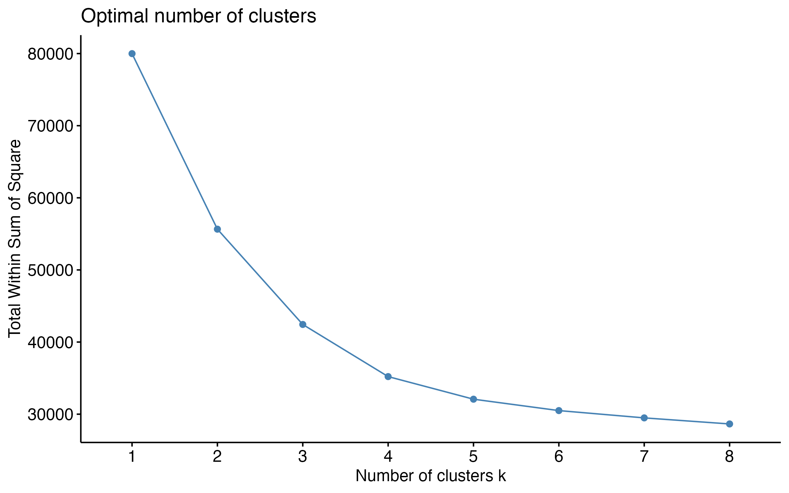
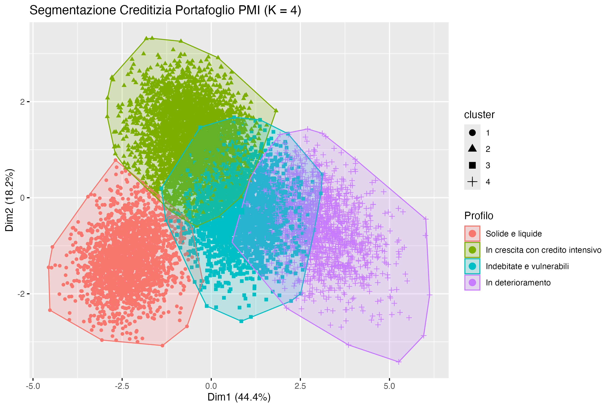

# pmi-credit-risk-clustering
Unsupervised K-Means clustering in R on a portfolio of 10,000 SMEs for corporate credit risk segmentation and financial health monitoring.
# 📊 Corporate Financial Health & Credit Risk Segmentation (K-Means in R)

Analisi di clustering non supervisionato condotta su un portafoglio creditizio di **10.000 PMI** per segmentare la clientela in base agli equilibri economico-finanziari e al comportamento nell'utilizzo delle linee di credito, supportando il monitoraggio del rischio e le decisioni di affidamento bancario.

---

## 📌 Business Problem & Obiettivo

Gli istituti bancari necessitano di individuare tempestivamente l'eterogeneità dei profili di rischio aziendali per:
* Riconoscere imprese sane a cui destinare strategie di cross-selling ed espansione del credito.
* Identificare precocemente segnali di tensione finanziaria e degrado creditizio prima che si trasformino in sofferenze (*Early Warning*).

Il progetto applica l'algoritmo **K-Means** per clusterizzare il portafoglio in gruppi omogenei, validando ex-post la coerenza dei cluster rispetto a metriche di rischio non utilizzate durante il training (Rating Interno, Stato Pagamenti e PD a 12 mesi).

---

## 🛠️ Stack Tecnologico & Strumenti

* **Linguaggio:** R (v4.x)
* **IDE:** RStudio
* **Librerie Principali:**
  * `cluster` & `factoextra`: calcolo dell'algoritmo K-Means, diagnostica WSS (Elbow Method), Silhouette Analysis e visualizzazione PCA.
  * `readxl` & `dplyr`: importazione, pulizia, selezione e aggregazione dei dati.
  * `ggplot2`: data visualization avanzata.

---

## 🔬 Protocollo Metodologico

### 1. Selezione delle Variabili (Feature Selection)
L'analisi esclude rigorosamente identificativi, variabili di scala assoluta (es. fatturato totale) e indicatori di rischio pregressi per evitare distorsioni e circolarità analitica. Sono state selezionate **8 metriche chiave standardizzate tramite Z-score ($\mu=0, \sigma=1$)**:
* **Crescita & Redditività:** `crescita_fatturato_pct`, `ebitda_margin_pct`, `roa_pct`
* **Liquidità & Struttura Finanziaria:** `current_ratio`, `debt_equity`, `dscr`
* **Comportamento Creditizio:** `utilizzo_affidamenti_pct`, `giorni_ritardo_medi`

### 2. Scelta del Numero Ottimale di Cluster ($K$)
È stato condotto un confronto quantitativo su soluzioni da $K=2$ a $K=8$ combinando:
* **Metodo del Gomito (WSS):** flessione pronunciata tra $K=3$ e $K=4$, indicativa di stabilizzazione della varianza intra-cluster.
* **Silhouette Score:** tenuta dell'indice di coesione interna/separazione ($s \approx 0.275$).

> **Verdetto di Modellazione:** È stata selezionata la soluzione **$K = 4$**, in quanto offre il miglior bilanciamento tra interpretabilità economico-finanziaria dei sottogruppi e granularità operativa per la banca, evitando la perdita informativa di $K=2/3$ e la sovrasegmentazione di $K=5$.

---

## 📈 Mappa dei Cluster & Profili Finanziari

La proiezione dei cluster sulle prime due componenti principali (PCA) spiega oltre il 62% della varianza totale:

### Tabella di Sintesi & Validazione Ex-Post

| Cluster / Profilo | Imprese | Peso % | Crescita Fatt. (%) | EBITDA Margin (%) | ROA (%) | Current Ratio | Debt / Equity | DSCR | PD 12M (%) | Azione Manageriale Suggerita |
| :--- | :---: | :---: | :---: | :---: | :---: | :---: | :---: | :---: | :---: | :--- |
| **Solide e liquide** | 2.230 | 22.3% | +4.4% | 16.1% | 7.1% | 2.00 | 0.84 | 1.79 | **0.34%** | *Sviluppo commerciale, retention, concessione linee a tassi competitivi* |
| **In crescita (credito intensivo)** | 3.561 | 35.6% | +14.6% | 17.2% | 9.2% | 0.98 | 1.82 | 1.38 | **0.66%** | *Supporto agli investimenti con monitoraggio dell'assorbimento di circolante* |
| **Indebitate e vulnerabili** | 2.537 | 25.4% | +2.2% | 10.6% | 3.9% | 1.16 | 3.84 | 0.95 | **1.20%** | *Richiesta garanzie addizionali, divieto aumento affidamenti a revoca* |
| **In deterioramento** | 1.672 | 16.7% | -9.3% | 2.9% | -2.6% | 0.74 | 3.00 | 0.74 | **7.67%** | *Watchlist / Early Warning, piani di rientro e ristrutturazione dell'esposizione* |

## 💡 Valore di Business & Conclusioni

* **Validazione del Rischio:** Il modello non supervisionato ha separato efficacemente la qualità creditizia: il cluster *In deterioramento* presenta una Probabilità di Default media (**7.67%**) oltre **22 volte superiore** rispetto al cluster *Solide e liquide* (**0.34%**).
* **Prevenzione delle Insolvenze:** L'identificazione del cluster *Indebitate e vulnerabili* (DSCR < 1.0) permette alla funzione Crediti di intervenire tempestivamente prima che l'erosione di cassa si traduca in default conclamato.
